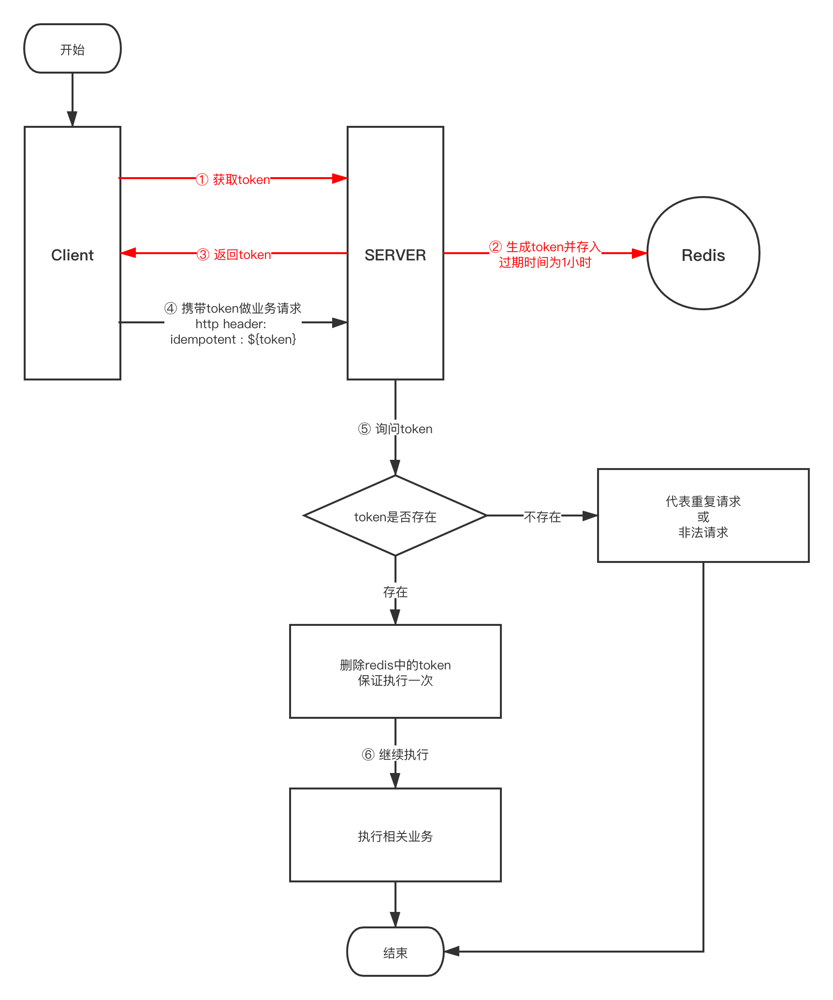
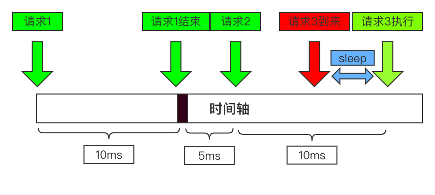
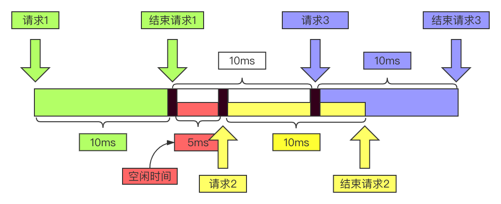

# go-gin
### 基于gin框架的web脚手架

---

>#### web架构基于gin架构，增加了相关功能
>> + 优雅停服；
>> + 基于nacos的服务注册与发现（可选）；
>> + 基于nacos实现服务间调用的负载均衡（轮询）；
>> + 基于nacos的配置中心（可选）；
>> + 基于zap的日志管理（可选）；
>> + 动态压缩日志，打包，滚动；
>> + 修改了zap的日志输出为json格式，方便后期进行日志分析；
>> + 重写zap日志的打印方法，并重新定义日志输出引用所在文件、方法和代码行数；
>> + 增加了框架基于内网和nacos的服务注册发现的服务间调用，支持GET、POST、PUT、DELETED请求方法（可选）；
>> + 增加了内部调用重试机制，可在nacos中进行重试次数配置（可选）；
>> + 基于gorm框架，实现了读写分离双连接池，可在nacos中进行配置（可选）；
>> + 封装了GET、POST、PUT、DELETE的HTTP请求方法；
>> + 增加了面向前面的请求与响应日志输出；
>> + 增加了全局统一的错误处理（包括日志输出）;
>> + 增加了TRACE-ID和STEP-ID的日志打印（可选）；
>> + 增加了TRACE-ID和STEP-ID在服务间调用的应用和STEP-ID的自增；
>> + 增加了本地配置文件与代码解耦；
>> + 基于validated，完成RestFul接口参数校验；
>> + 动态调节日志输出级别（可选）；
>> + 基于nacos的自定义配置，动态更新（可选）；
>> + redis连接池（可选）；
>> + 增加了关闭系统时，释放Redis连接池与数据库连接池的句柄；
>> + 业务报错适配器；
>> + 请求超时处理，统一配置预设值，提前返回超时设置；
>> + 根据配置环境不同，加载方式变更（开发环境没有超时设定，支撑Debug）;
>> + 增加基于redis + token的幂等接口处理；
>> + 基于nacos + uber/rateLimiter接口限流；

---

## 配置文件
```yaml
# 是否开启nacos配置中心
NacosConfiguration: true
# 是否开启nacos服务注册于发现
NacosDiscovery: true
# nacos地址
NacosServerIps: '127.0.0.1'
# nacos端口号
NacosServerPort: 8848
# nacos命名空间
NacosClientNamespaceId: 'f3e0c037-7fe1-452f-8f37-16b3810846b5'
# 请求Nacos服务端的超时时间（ms）
NacosClientTimeoutMs: 5000
# nacos配置文件名称
NacosDataId: 'go-framework.yml'
# nacos配置组名称
NacosGroup: 'go-framework'
# 项目启动环境：DEBUG-开发，TEST-测试，RELEASE-生产
ProgramEnv: 'DEBUG'
# 日志输出路径(本地配置优先级最高)
LogPath: ''
# 日志级别(本地配置优先级最高)
LogLevel: ''
```

---

## nacos配置文件
```yaml
# 服务的配置
serve:
  # 端口号
  port: 28080
  # 服务名称
  server-name: 'go-framework'
  # 服务权重
  weight: 10
# 日志配置
log:
  # 日志地址
  path: '/Users/xxx/logs/golang'
  # 日志级别（可动态修改）
  level: 'info'
# 数据库配置（可选）
gorm:
  # 读库配置
  read: 
    # 数据库用户名
    username: 'root'
    # 数据库密码
    password: 'abcdefg'
    # 数据库IP
    ip: '127.0.0.1'
    # 数据库端口
    port: 3306
    # 数据库名称
    dbname: 'go_framework'
  # 写库配置
  write: 
    # 数据库用户名
    username: 'root'
    # 数据库密码
    password: 'abcdefg'
    # 数据库IP
    ip: '127.0.0.1'
    # 数据库端口
    port: 3306
    # 数据库名称
    dbname: 'go_framework'
# 内部调用配置
feign:
  # 内部调用重试次数（可选）
  retry-num: 3
# redis配置（可选）
redis:
  # redis的IP和端口
  ip-port: '127.0.0.1:6379'
  # 密码口令
  password: 'xxx'
  # 数据库号：0-15
  database: 0
  # 连接超时时间（秒）
  connect-timeout: 2
  # 读超时时间（秒）
  read-timeout: 2
  # 写超时时间（秒）
  write-timeout: 2
  # 最大挂起数
  max-idle: 6
  # 最大活跃数
  max-active: 4
  # 最大挂起时间（秒）
  idle-timeout: 60
```

---

## nacos自定义配置内容使用
### 配置内容
#### 在nacos中进行配置
```yaml
# 注：配置完毕后，在启动项目时，会增加监听，配置的字段为热配置，会随着nacos的配置文件修改和发布进行改变。
nacos-test-int: 100
nacos_test_struct:
  nacos-test-string: 'string word'
  nacos-test-bool: false
```
### 配置结构体声明
```go
type SignInNacos struct {
	NacosTestInt    int `json:"nacos_test_int" yaml:"nacos-test-int"`
	NacosTestStruct struct {
		NacosTestString string `json:"nacos_test_string" yaml:"nacos-test-string"`
		NacosTestBool   bool   `json:"nacos_test_bool" yaml:"nacos-test-bool"`
	} `json:"nacos_test_struct" yaml:"nacos_test_struct"`
}
```
### 使用方式
```go
// 全局声明使用的实体类
var (
	testNacos *params.SignInNacos
)

// 在init方法中把实体类实例化后放入全局配置处理容器中
func init() {
    // testNacos = &params.SignInNacos{} // 实体化方式 ①
    testNacos = new(params.SignInNacos)  // 实体化方式 ②
    nacos.InsertSelfProfile(testNacos)   // 放入全局配置处理容器中
}
```
### 使用配置内容
```go
	// 返回信息
	c.SuccRes(&params.SignInRtn{
		UserName:        signInParam.UserName,
		PassWord:        signInParam.PassWord,
		Timestamp:       signInParam.Timestamp,
		NacosTestInt:    testNacos.NacosTestInt,                    // 使用
		NacosTestBool:   testNacos.NacosTestStruct.NacosTestBool,   // 使用
		NacosTestString: testNacos.NacosTestStruct.NacosTestString, // 使用
	})
```

---

## 业务报错适配器
### 使用方式
```go
package wrong

import "github.com/MassAdobe/go-gin/errs"

// 定义错误码和错误描述
const (
	//自定义错误码
	ErrLoginCode = 1000 + iota // 登录错误

	//自定义错误描述
	ErrLoginDesc = "登录错误(用户名密码错误或不存在相关用户)"
)

// 定义错误码和错误描述的容器
var CodeDescMap = map[int]string{
	// 自定义错误
	ErrLoginCode: ErrLoginDesc,
}

// 塞入脚手架中
func init() {
	errs.AddErrs(CodeDescMap)
}
```
### 业务使用
```go
func SignIn(c *goContext.Context) {
	signInParam := new(params.SignInParam)
	validated.BindAndCheck(c, signInParam)
	c.Debug("登录")
	c.Info("登录", logs.Desc("abc"))
    if len(signInParam.UserName) == 0 {
        panic(errs.NewError(wrong.ErrLoginCode)) // 使用panic全局报错
    }
	c.SuccRes(&params.SignInRtn{
		UserName:        signInParam.UserName,
		PassWord:        signInParam.PassWord,
		Timestamp:       signInParam.Timestamp,
		NacosTestInt:    testNacos.NacosTestInt,
		NacosTestBool:   testNacos.NacosTestStruct.NacosTestBool,
		NacosTestString: testNacos.NacosTestStruct.NacosTestString,
	})
}
```

---

## 幂等使用
#### 需要使用幂等时，需要确保宿主程序有redis配置，并且可以连接；
### 逻辑：

### 使用方式：
+ 所有的前端幂等请求需要提前访问http://ip:port/other/idempotentToken接口
+ 返回：
```json
{
    "code": 0,
    "msg": "成功",
    "data": "1M7G6QKMlVpaDGv8oHZAYCO06p4epZdIssPt7wk4PgVP2OCfxHUiPfidGYf1h1d8"
}
```
+ 其中data值为token，在调用幂等接口时需要在http头部增加token值，例如：
+ header `key: idempotent;   value: 1M7G6QKMlVpaDGv8oHZAYCO06p4epZdIssPt7wk4PgVP2OCfxHUiPfidGYf1h1d8`
#### 幂等路由
```go
func Routers() (rtr *gin.Engine) {
    rtr = routers.NewRouter()
    // 示例接口
    idempotent := rtr.Group(nacos.RequestPath("idempotent").Use(filter.SetTraceAndStep())
    {
        login.POST("/testIdempotent", filter.GetReqUser(), filter.ValidIdempotent(),
        goContext.Handle(controller.TestIdempotent)) // 测试幂等接口
    }
    return
}
```
其中
+ `filter.GetReqUser()`是校验用户信息的插件，必须存在；
+ `filter.ValidIdempotent()`是校验幂等要素的插件，必须存在；
#### 幂等接口
```go
/**
 * @Description: 测试幂等接口(正常写接口即可)
**/
func TestIdempotent(c *goContext.Context) {
	testIdempotentParam := new(params.TestIdempotentParam)
	validated.BindAndCheck(c, testIdempotentParam)
	c.SuccRes(&params.TestIdempotentParamRtn{
		String: testIdempotentParam.TestString,
		Int:    testIdempotentParam.TestInt,
	})
}
```

---

## 限流使用
### 原理介绍
+ 该功能是基于uber的rateLimiter漏斗实现的限流手段；
+ 可基于nacos配置是否使用该限流；
+ 如果开启限流，一种为全局限流，一种为单接口限流；
+ 设置的Rate参数是每秒允许请求量(RPS)；
+ 可以很轻易的换算出每个请求之间的间隔`limiter.perRequest = time.Second / time.Duration(rate)`
+ 以上limiter.perRequest指的就是每个请求之间的间隔时间；
+ 当请求1处理结束后, 我们记录下请求1的处理完成的时刻, 记为limiter.last。 稍后请求2到来, 如果此刻的时间与limiter.last相比并没有达到perRequest的间隔大小，那么sleep一段时间即可。如下图：
+ 
+ 最大松弛量：每个请求的间隔是固定的，然而，在实际上的互联网应用中，流量经常是突发性的。对于这种情况，uber-go对Leaky Bucket做了一些改良，引入了最大松弛量(maxSlack)的概念。
+ 假如我们要求每秒限定100个请求，平均每个请求间隔10ms。但是实际情况下，有些请求间隔比较长，有些请求间隔比较短。如下图所示：
+ 
+ 请求1完成后，15ms后，请求2才到来，可以对请求2立即处理。请求2完成后，5ms后，请求3到来，这个时候距离上次请求还不足10ms，因此还需要等待5ms；
+ 但是，对于这种情况，实际上三个请求一共消耗了25ms才完成，并不是预期的20ms。在uber-go实现的ratelimit中，可以把之前间隔比较长的请求的时间，匀给后面的使用，保证每秒请求数(RPS)即可；
+ 对于以上case，因为请求2相当于多等了5ms，我们可以把这5ms移给请求3使用。加上请求3本身就是5ms之后过来的，一共刚好10ms，所以请求3无需等待，直接可以处理。此时三个请求也恰好一共是20ms。 如下图所示：
+ 
+ 把每个请求多余出来的等待时间累加起来，以给后面的抵消使用。
### 使用方式
+ 在nacos中增加配置；
+ 第一种：个别接口限流，支持热修改，可增加、修改、删除；
```yaml
# 限流（漏斗）
rate:
  # 限流接口以及限流数
  interface-and-rate: 
    '/login/signIn': 1
    '/login/getUser': 2
```
其中`interface-and-rate`是单个接口限流配置，用的是yaml的map方式进行配置，`'/login/signIn'和'/login/getUser'`是键，`1 和 2`是值，分别表示要限制的接口名（与调用路径一致）和RPS数；
+ 第二种：全局限流：
```yaml
# 限流（漏斗）
rate:
  # 是否是全局
  all: true
  # 限流数量
  rate: 100
```
其中`all`是布尔值，如果为`true`则开启全局限流，那么单个接口限流无效；如果为`false`，那么将不适用全局限流，如果同时没有配置单个接口限流，那么则不启动限流功能；`rate`为限流数量（RPS）。

---

>## 未做功能
>> + 服务熔断；
>> + 服务降级；

